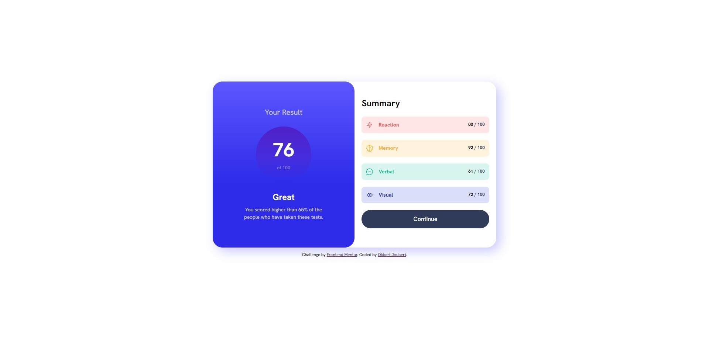

# Frontend Mentor - Results summary component solution

This is a solution to the [Results summary component challenge on Frontend Mentor](https://www.frontendmentor.io/challenges/results-summary-component-CE_K6s0maV). Frontend Mentor challenges help you improve your coding skills by building realistic projects.

## Table of contents

- [Overview](#overview)
  - [The challenge](#the-challenge)
  - [Screenshot](#screenshot)
  - [Links](#links)
- [My process](#my-process)
  - [Built with](#built-with)
  - [What I learned](#what-i-learned)
  - [Continued development](#continued-development)
  - [Useful resources](#useful-resources)
- [Author](#author)

**Note: Delete this note and update the table of contents based on what sections you keep.**

## Overview

### The challenge

Users should be able to:

- View the optimal layout for the interface depending on their device's screen size
- See hover and focus states for all interactive elements on the page

### Screenshot



### Links

- Solution URL: [https://www.frontendmentor.io/solutions/resultssummarycomponent-r2TV5isqBG]
- Live Site URL: [https://score-card-frontend-mentor.vercel.app/]

## My process

### Built with

- Semantic HTML5 markup
- CSS custom properties
- Flexbox
- CSS Grid
- Mobile-first workflow
- JavaScript

### What I learned

I used this challenge as an opportunity to challenge myself with javascript and getting data from a json file and displaying it on the screen. I am especially proud of the following sets of codes, as this was my first time using async and await syntax and displaying information that is not hard coded. In CSS I had to use :first-child for the first time as well, which was very interesting to me.

To see how you can add code snippets, see below:

```html
<div id="category" class="category"></div>
```

```css
.summ-info:first-child {
  background-color: var(--primary-red-box);
  color: var(--primary-red);
}

.summ-info:nth-child(2) {
  background-color: var(--primary-yellow-box);
  color: var(--primary-yellow);
}

.summ-info:nth-child(3) {
  background-color: var(--primary-teal-box);
  color: var(--primary-teal);
}

.summ-info:last-child {
  background-color: var(--primary-cobalt-box);
  color: var(--primary-cobalt);
}
```

```js
const getData = async () => {
    try{
        const response = await fetch("data.json");
        if (response.ok) {
            const jsonResponse = await response.json();
            jsonResponse.forEach((data, index)
```

### Continued development

In future projects I am definitely going to add more JavaScript to my websites to get better and more comfortable with JavaScript

### Useful resources

- Kevin Powell is an amazing help when it comes to CSS and styling of websites and have been using his videos for guidance
- W3School is a great website to learn more about JavaScript and using some of the features of JavaScript

## Author

- Frontend Mentor - [@Okkie14](https://www.frontendmentor.io/profile/Okkie14)
